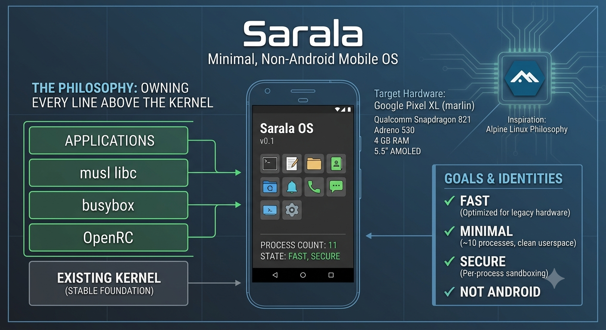

# Sarala

A minimal, non-Android mobile operating system for the Google Pixel XL.

📖 **Documentation site:** <https://rukmaldias.github.io/Sarala/>

Sarala is a learning project in mobile systems, built on one organising principle: **don't write a kernel, but own every line above it.** This is the Alpine Linux philosophy applied to a phone. Alpine's identity isn't a kernel — it's musl, busybox, OpenRC, and a deliberately small userspace. Sarala's identity will be its userspace too.

## Goals

**Fast** — on hardware the Android ecosystem abandoned. The Snapdragon 821 is not slow; stock Android on it is slow, for reasons that live above the kernel.

**Minimal** — a system small enough that one person can hold all of it in their head. Roughly ten processes, no daemon whose purpose is unclear.

**Secure** — minimalism and security compound. Per-process sandboxing is tractable at ten processes and never tractable on a general-purpose distro.

Not goals: Android app compatibility, Play Store, or a general-purpose distribution. Camera is an optional stretch goal with a plausible path but poor expected image quality — see [`docs/risks.md`](docs/risks.md).

## Target hardware

**Google Pixel XL (`marlin`)**, Qualcomm MSM8996 Pro / Snapdragon 821, Adreno 530, 4 GB RAM, 5.5" AMOLED.

Chosen because it is owned rather than ideal — but it turned out well. The MSM8996 SoC is one of the best-mainlined Qualcomm phone platforms, thanks to upstream investment via the Dragonboard 820c and the ongoing [msm8996-mainline](https://gitlab.com/msm8996-mainline) project. Roughly twenty sibling phones have working device trees to learn from.

Marlin itself has never been ported. That is the first milestone, and the best learning artifact in the project.

## What is borrowed, and what is written

Borrowed: the Linux kernel and its driver ecosystem, Mesa/freedreno, ALSA plumbing, and — during early stages only — busybox.

Written: PID 1 and the service supervisor, the marlin device tree, the Wayland compositor, the telephony daemon, and every application.

The kernel's driver ecosystem is the one component no individual can rewrite. Everything else is in scope.

## Status

**Stage 0 — complete.** A Rust PID 1 boots the mainline kernel under
`qemu-system-aarch64 -M virt` and hands back an interactive shell;
`/proc/1/comm` reports `init`. See [`docs/stage0-notes.md`](docs/stage0-notes.md).

**Stage 1 — marlin bring-up: interactive shell achieved, now installed on-device.**
The mainline kernel boots on the Pixel XL to a Sarala `/bin/sh` prompt on the
3.5mm-jack serial console — **persistent and typable**, and now **flashed to the
boot partition** so it comes up standalone on every reboot (no `fastboot boot`).
No mainline marlin port existed to start from — this is a first port. What got
here:

- Hardware mined from the downstream device tree — touchscreen, panel,
  regulators, UFS, serial ([`boards/marlin/hardware.md`](boards/marlin/hardware.md)).
- A marlin device tree that boots mainline past every unpowered-peripheral NOC
  abort ([`boards/marlin/dts/`](boards/marlin/dts/)).
- A `boot.img` with marlin's verified-boot geometry
  ([`boards/marlin/boot-image.md`](boards/marlin/boot-image.md)).
- Console on the 3.5mm jack, verified with a DIY 3.3V FTDI cable
  ([`boards/marlin/serial-console.md`](boards/marlin/serial-console.md)). The jack
  UART is **blsp2_uart2** and must be the *real* console (`console=ttyMSM1`), else
  an earlycon-vs-power-off race triggers an `RPM:TZ ABORT`.
- The APSS watchdog (`watchdog@9830000`) so the boot-armed watchdog is petted and
  the shell persists past ~15 s.
- All verified on hardware, end to end (typed commands execute over serial). See
  [`boards/marlin/first-boot.md`](boards/marlin/first-boot.md).

Next: replace the oneplus device-tree masquerade with a genuinely marlin-specific
node set, and grow userspace beyond the stage-1 shell.

## Layout

| Path | Contents |
|---|---|
| `init/` | PID 1, written in Rust |
| `boards/marlin/` | Pixel XL device tree and port notes — hardware facts, boot image, serial access |
| `scripts/` | Image assembly and emulator invocation |
| `docs/` | Design, roadmap, and honest accounting of risk |

## Documentation

Browsable at **<https://rukmaldias.github.io/Sarala/>** (rendered from `docs/`
and `boards/` with Docusaurus). The source files:

| Document | Purpose |
|---|---|
| [`docs/architecture.md`](docs/architecture.md) | Layer-by-layer design and the borrow/write boundary |
| [`docs/roadmap.md`](docs/roadmap.md) | Staged milestones with explicit exit criteria |
| [`docs/build-environment.md`](docs/build-environment.md) | Reproducible development setup |
| [`docs/stage0-notes.md`](docs/stage0-notes.md) | Stage 0 build log: the working recipe and its sharp edges |
| [`docs/threat-model.md`](docs/threat-model.md) | Trust boundaries and honest security limits |
| [`docs/risks.md`](docs/risks.md) | What could stall this project |

## A note on honesty

These documents try hard to distinguish what is known from what is hoped. Where a claim about hardware or upstream support appears, it is either cited or marked as unverified. Where something is likely to fail — call audio, battery life, the camera — it is written down as such rather than discovered later.
